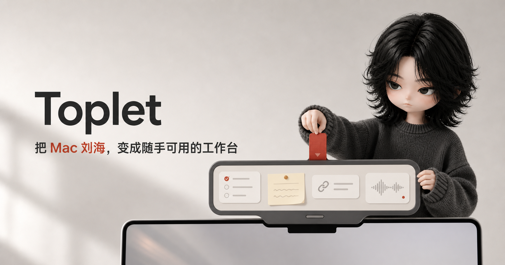
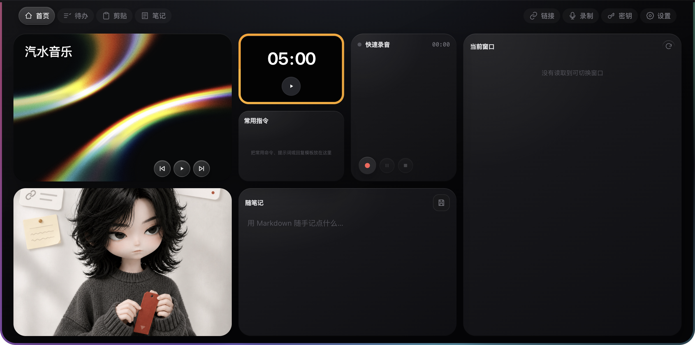
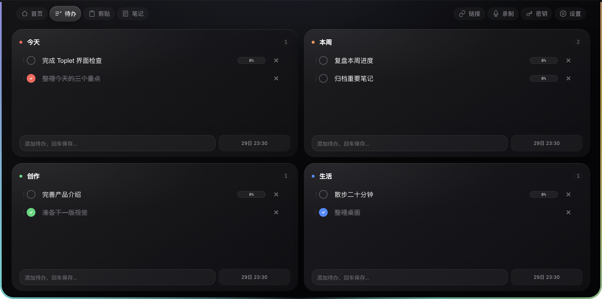

<div align="center">
  
  <h1>Toplet</h1>
  <p><strong>把 Mac 刘海，变成随手可用的工作台。</strong></p>
  <p>待办、随笔记、链接、录音与本机 AI 提醒，始终贴顶待命。</p>
  <p>
    <a href="https://github.com/zaoshangduziteng/toplet/releases/latest"><strong>下载 macOS 版</strong></a>
    ·
    <a href="#从源码运行">从源码运行</a>
    ·
    <a href="#更新日志">更新日志</a>
    ·
    <a href="https://github.com/zaoshangduziteng/toplet/issues">反馈问题</a>
  </p>
  <p>
    
    
    
    
  </p>
</div>







## 它是什么

Toplet 是一个常驻 macOS 屏幕顶部的本地工作台。默认折叠成物理刘海大小，点击后从顶部展开；常用信息和动作不必再散落在多个应用里。

| 页面 | 解决什么问题 |
| --- | --- |
| **首页** | 当前窗口、镜子、快速录音、随笔记、常用指令、汽水音乐和番茄钟集中在一个 Bento 工作台 |
| **待办** | 四个可改名的工作流，截止日期可逐月切换并自然跨年，按截止时间排序，并在到期前一小时提醒 |
| **随笔记** | Markdown 速记、归档、搜索、重命名与智能标题 |
| **链接** | 保存公开网址，后台补全标题、图标和分组 |
| **录制** | 录音开始即创建实时记录，同步显示状态与转写，并可在页内配置 API |
| **密钥** | 使用 macOS 安全存储加密账号、密码和 API Key |
| **设置** | 当菜单栏图标被刘海遮挡时，仍可在面板内配置 API、镜子、功能显示、快捷键、数据目录与开机启动 |

剪贴板历史默认关闭，可从菜单栏或面板「设置」的「显示功能」中按需启用。菜单栏入口与设置页读写同一份本机配置；即使状态栏图标过多、被物理刘海遮挡，也不影响调整。Codex、Claude Code 与 GPT 的本机完成事件也可以直接显示为不抢焦点的顶部提醒。

## 下载与安装

> 当前版本：**1.0.2** · 支持 **Apple Silicon Mac**

1. 前往 [GitHub Releases](https://github.com/zaoshangduziteng/toplet/releases/latest) 下载 `Toplet-*-arm64.dmg`。
2. 打开 DMG，将 `Toplet.app` 拖入「应用程序」。
3. 首次启动若被 macOS 拦截，前往「系统设置 → 隐私与安全性」，点击「仍要打开」。
4. 再次启动，根据需要授予辅助功能、屏幕录制、麦克风或摄像头权限。

项目明确采用 GitHub Releases + ad-hoc 签名分发，不进行 Apple 公证，也不上架 Mac App Store。因此首次安装需要手动确认“仍要打开”；这是当前正式分发方式，不是待修复的发布缺陷。每次重新打包后，macOS 可能要求重新授权；由 `safeStorage` 加密的密钥也可能需要重新填写。

## 更新日志

当前稳定版本为 **v1.0.2**。正在开发但尚未发布的改动会先记录在 `[未发布]`，正式发版时再归档到对应版本，避免 README 随版本增加而持续膨胀。

完整版本历史、修复内容与未发布改动见 [CHANGELOG.md](CHANGELOG.md)。

## 设计原则

- **贴顶但不打扰**：折叠态宽 200px，高度跟随菜单栏；展开与通知都不使用系统窗口动画。
- **设备按需启用**：镜子只有主动点击才开启，离开首页或收起时立即释放摄像头；麦克风同理。
- **数据留在本机**：待办、笔记、链接、录音元数据和工作区设置保存在本地，无后端和云同步。
- **权限边界清晰**：链接元数据抓取会阻止本机、内网地址和不安全重定向；窗口聚焦只接受最近扫描缓存中的 ID。
- **可迁移工作区**：可从菜单栏选择数据文件夹，换电脑时复制该文件夹继续使用。

## 本机 AI 完成提醒

Toplet 只在 `127.0.0.1:43821` 监听通知接口，来源限 `codex`、`claude` 与 `gpt`：

```bash
curl -X POST http://127.0.0.1:43821/notify/codex \
  -H 'Content-Type: application/json' \
  -d '{"title":"任务已完成","project":"my-project","task_id":"demo"}'
```

仓库已提供 [Codex 转发脚本](scripts/codex-notify.js) 和 [Claude Code 转发脚本](scripts/claude-notify.js)。通过 DMG 安装后，脚本路径为：

```text
/Applications/Toplet.app/Contents/Resources/app/scripts/codex-notify.js
/Applications/Toplet.app/Contents/Resources/app/scripts/claude-notify.js
```

## 从源码运行

桌面端要求 Node.js 18+：

```bash
git clone https://github.com/zaoshangduziteng/toplet.git
cd toplet
npm install
npm test
npm start
```

项目使用单一 Electron 架构，没有渲染层构建步骤，`npm start` 是完整运行路径。

| 命令 | 用途 |
| --- | --- |
| `npm test` | 单元测试与 JavaScript 语法检查 |
| `npm start` | 启动 Electron 开发版 |
| `npm run pack` | 生成未安装的 `.app` |
| `npm run build` | 生成 Apple Silicon DMG |
| `npm run build:zip` | 生成 ZIP 分发包 |

## 项目结构

```text
.
├── main.js                 # Electron 主进程、窗口与系统服务
├── main-services.js        # 可测试的纯领域服务
├── preload.js              # contextBridge 安全桥
├── renderer/               # 桌面界面与交互
├── tests/                  # Node 单元测试
├── build/                  # 图标、签名与 DMG 配置
├── scripts/                # Codex / Claude Code 通知转发
└── docs/                   # 设计、ADR、项目视觉与发布说明
```

## 发布

推送与 `package.json` 版本一致的 `v*.*.*` 标签后，GitHub Actions 会自动测试、构建并校验 DMG，然后将安装包和 SHA-256 文件上传到 Releases。完整流程见 [发布说明](docs/releasing.md)。

## License

[MIT](LICENSE) © 2026 [zaoshangduziteng](https://github.com/zaoshangduziteng)
